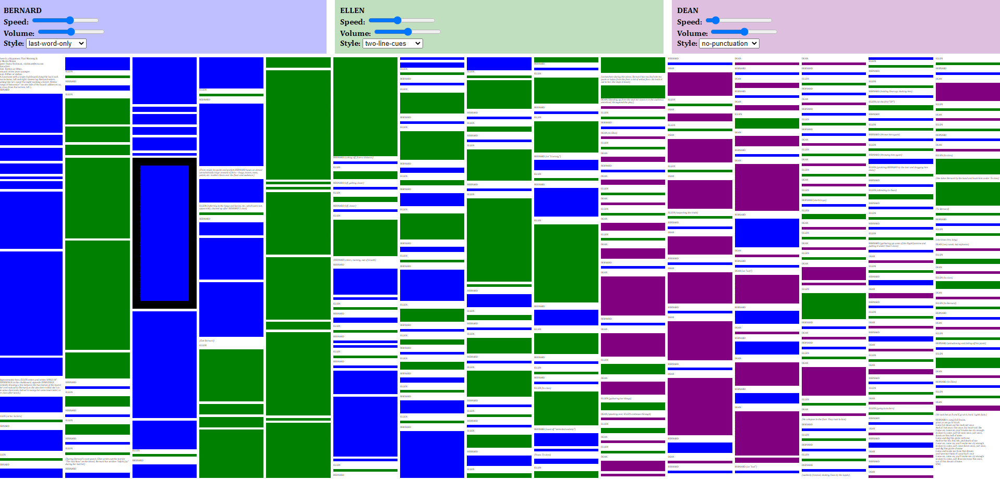

# Memorization aid for _There Is a Happiness That Morning Is_

This utility generates a browser-based memorization aid for
Mickle Maher's play, [_There Is a Happiness That Morning Is_](http://sixplaysmicklemaher.com/there-is-a-happiness-that-morning-is/).

## Basic usage

Click a colored block of text to hear it spoken aloud. Click it again to make
it stop. Playback will automatically continue to the next block.

Customize each character's speech using the controls at the top of the page.

## Features

Each character's speech characteristics can be controlled independently:

  * speed
  * volume
  * speech style

There are currently six speech styles to choose from:

  * straight (full text read with punctuation)
  * no-punctuation (full text with no pauses, like a speed-thru)
  * last-word-only (the last word of each line, useful for rhyming verse)
  * two-line-cues (just the last two lines of each stanza)
  * one-line-cues (just the last line of each stanza)
  * line-boundaries (full text at varying speed, emphasizing the last and first words of each line)

The script is copyrighted and is not included in the public repository. Thus,
you unfortunately cannot see a demo of the result.

## Technical details

This utility uses [Amazon Polly](https://aws.amazon.com/polly/) to generate the speech sound files
and the [Saxon-HE XSLT processor](https://saxonica.com/products/products.xml) to:

  1. convert the script text file to XML,
  2. generate the speech text inputs for Amazon Polly,
  3. generate the scripts for invoking Polly, and
  4. generate the final HTML page.

The script started as a PDF file. I used an online utility to extract its text and then
manually cleaned up the text file (especially by adding blank lines between "stanzas").

## Future work
I plan to adapt this utility for additional scripts as I encounter them
and eventually abstract from these a more generically reusable tool.
